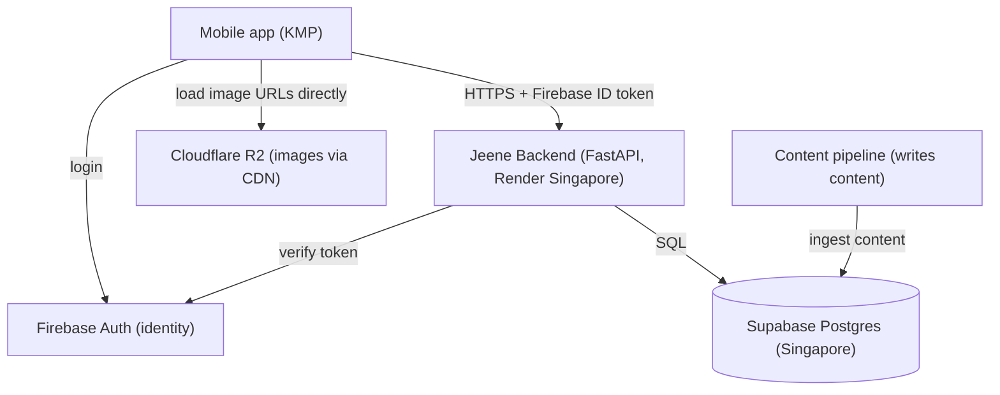

# Jeene Backend — Product Requirements Document

**Product:** the server-side backend for **Jeene**, an AI exam-prep app for NEET (Indian medical entrance).
**Status:** foundation. v1 scope locked; later phases documented for direction.

---

## 1. Overview & vision

The backend is the single interface between the Jeene mobile app and everything server-side. The app talks **only** to this backend; it never touches the database directly. The backend owns content delivery, user identity, and, over time, the logic that must be trusted, evolvable, and composable: practice, grading, weakness detection, adaptive practice, an AI tutor, and payments.

The content itself is produced by a separate content pipeline and lands in Postgres as NCERT-grounded, reviewed data. The backend **reads and serves** that content; it never authors it.

Vision: a fast, reliable API that serves NCERT-grounded content and powers a personalized, adaptive NEET-prep experience for Indian students.

## 2. Goals & non-goals

**Overall product goals (the backend will grow to cover all of these):**
- Serve content (concept tree, questions with LaTeX math, figures) to the app.
- Authenticate users and own their data.
- Record practice attempts and grade them server-side.
- Detect concept-level weaknesses and drive adaptive practice.
- Provide an AI tutor.
- Handle payments and premium entitlements.

**v1 goals (this milestone):**
- A read-only **content API**: chapters, concept tree, and questions (by chapter/concept), with LaTeX math and figure URLs.
- **Firebase auth**: verify the app's Firebase ID token and establish a user record on first login.
- **Deployed** on Render (Singapore) and reachable by the app over HTTPS.

**Non-goals for v1 (explicitly out, planned for later):**
- No attempts or grading yet (the practice loop is v1.1).
- No weakness detection, adaptive practice, or AI tutor (later phases).
- No payments or premium gating (deferred; everything is free for now).
- No content authoring or writes to content tables (that is the pipeline's job).
- No admin/teacher-facing endpoints.

## 3. Target users & roles

- **Students** (NEET aspirants). Many are **under 18**, so children's-data handling under India's DPDP applies (parental consent is an app-side concern; the backend keeps data secure and purpose-limited).
- v1 role model: an **authenticated student**. Richer roles (admin, teacher) come later.

## 4. System architecture

**Components**
- **API:** FastAPI (Python), async, run by uvicorn. Endpoints return JSON.
- **Database access:** an `asyncpg` connection pool to Supabase Postgres. The backend connects as the database role, which bypasses RLS; the public HTTP/Data API surface stays closed.
- **Identity:** the app authenticates with **Firebase Auth** and sends its Firebase ID token on each request. The backend verifies the token with the Firebase Admin SDK and reads the user's UID. All user data in Postgres is keyed by that Firebase UID. Firebase owns "who you are"; Postgres owns "what you've done."
- **Images:** figures live in **Cloudflare R2** and are served to the app directly by URL through Cloudflare's CDN. Only the URL is stored in the database (`question_figures.image_url`).
- **Hosting:** Render (Singapore), co-located with Supabase (Singapore) so backend-to-database queries are local. Users are in India (~50ms to Singapore, imperceptible for API calls; images come from R2's India edge).

**Data model (already in Postgres, produced by the pipeline)**
- `tenants` (multi-tenant from row one; `JEENE_MASTER` is the first-party content owner)
- `nodes` (the concept tree: subject/class/chapter/topic/subtopic/concept)
- `questions` (stem as `question_text` with LaTeX, `options_json`, `correct_option_ids`, `explanation_json`, `difficulty`, `question_type`, ...)
- `question_concept_mappings` (each question tagged to concepts, one primary)
- `question_figures` (`image_url` pointing at R2)
- `exams`, `exam_syllabus`

**New tables introduced by the backend**
- v1: a `users` table (keyed by Firebase UID) created on first login.
- Later: `attempts`, progress/mastery, entitlements, etc.

## 5. Feature spec by area

### 5.1 Content API (v1)
Read-only endpoints over the content tables, scoped to the `JEENE_MASTER` tenant for now:
- **List chapters** — the chapters available.
- **Chapter tree** — a chapter's topics → subtopics → concepts.
- **Questions by chapter / by concept** — question stem (LaTeX), options, difficulty, `question_type`, and figure URL(s). Paginated.
- **Single question** — the same, for one question.
- **Answer key / solution reveal** — a **separate** endpoint returning the correct option and worked solution for a question. Kept separate so the correct answer is **never** included in the normal question fetch. In v1 (before server-side grading exists) the app uses this to reveal the solution after the student has answered.

Integrity rule: the question-fetch endpoints must not leak `correct_option_ids` or `explanation_json`. Answers are only served through the explicit reveal endpoint, and once grading exists (v1.1) primarily through grading.

### 5.2 Auth (v1)
- The app logs in with Firebase (email and phone/OTP; phone-OTP is expected by Indian users).
- Every authenticated request carries the Firebase ID token in the `Authorization` header.
- The backend verifies the token (Firebase Admin SDK) and extracts the UID.
- On first authenticated request, upsert a `users` row keyed by the Firebase UID.
- Content-read endpoints may be public or auth-optional in v1; user-specific endpoints require a valid token.

### 5.3 Later phases (documented, not v1)
- **v1.1 Practice loop:** an `attempts` table; a submit-answer endpoint that grades server-side against the hidden key and records the attempt; progress tracking.
- **Weakness detection & analytics:** server-side aggregation of attempts by concept into mastery/weakness, with dashboard endpoints.
- **Adaptive practice:** recommend questions targeting weak concepts.
- **AI tutor:** LLM-backed explanations and doubt-solving (provider TBD).
- **Payments:** an Indian gateway (e.g. Razorpay) with entitlement checks; payment data stays with the gateway (RBI localization), the backend stores only references/entitlement state.

## 6. Non-functional requirements

- **Performance:** async FastAPI + connection pooling; backend and DB co-located in Singapore; content is cacheable.
- **Reliability:** Render always-on with health checks and auto-restart; managed Supabase (backups, HA are the provider's job).
- **Security:** all secrets in environment variables / a git-ignored `.env`, never committed. Firebase token verification on protected routes. The database's public API surface stays closed (RLS on, tables not auto-exposed); the backend connects with the privileged role. Question fetches never include answers.
- **Compliance:** DPDP is satisfied by handling (consent, purpose limitation, security, children's-data care) rather than forced India storage; Singapore hosting is permitted. When payments arrive, payment data is localized in India by the gateway.
- **Scale:** target at least 10k users; the architecture (stateless backend, pooled DB, cacheable content) handles well beyond, and the backend can scale to multiple instances.

## 7. Open decisions

- **Users table shape** beyond the Firebase UID (profile fields: name, target NEET year, class). Decide in the auth ticket.
- **Are content-read endpoints public or auth-required in v1?** (Recommendation: content readable with an optional token; user-specific data requires a token.)
- **Monetization model** — deferred; free for now.
- **AI provider** — deferred.
- **Grading and mastery formula** — designed in v1.1.

## 8. Decision log

| # | Decision | Choice |
|---|---|---|
| 1 | Backend framework | FastAPI (Python), async, uvicorn |
| 2 | Database | Supabase Postgres, Singapore region |
| 3 | Images | Cloudflare R2, served via CDN; only URL stored in DB |
| 4 | Backend hosting | Render, Singapore (co-located with the DB) |
| 5 | Client access model | Custom backend; the app talks only to it, never direct to the DB |
| 6 | Auth | Firebase Auth; backend verifies Firebase ID tokens, keys user data by Firebase UID |
| 7 | Multi-tenancy | Multi-tenant schema; `JEENE_MASTER` is the first-party tenant (v1 serves it only) |
| 8 | Math | Stored and served as LaTeX in `$…$` |
| 9 | Answer integrity | Question fetches never include correct answers/solutions; answers only via a separate reveal (and later grading) endpoint |
| 10 | v1 scope | Content read API + Firebase auth, deployed on Render; practice loop is v1.1 |
| 11 | Monetization | Deferred; free for now |
| 12 | AI provider | Deferred |
| 13 | Compliance | DPDP via handling (not forced localization); Singapore hosting; payment data localized in India via the gateway when payments arrive |
| 14 | Content ownership | The pipeline authors content; the backend only reads it |

---

*Next: run `/draft-architecture` to turn this into the project's `CLAUDE.md`, then `/draft-ticket` for the first feature (the content read API).*
